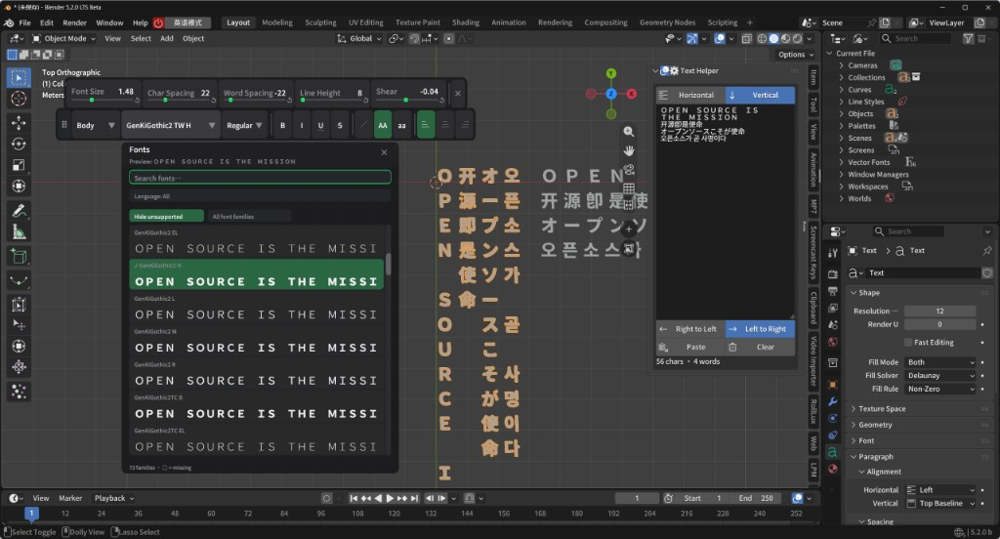
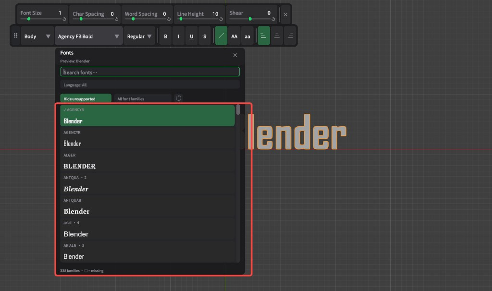
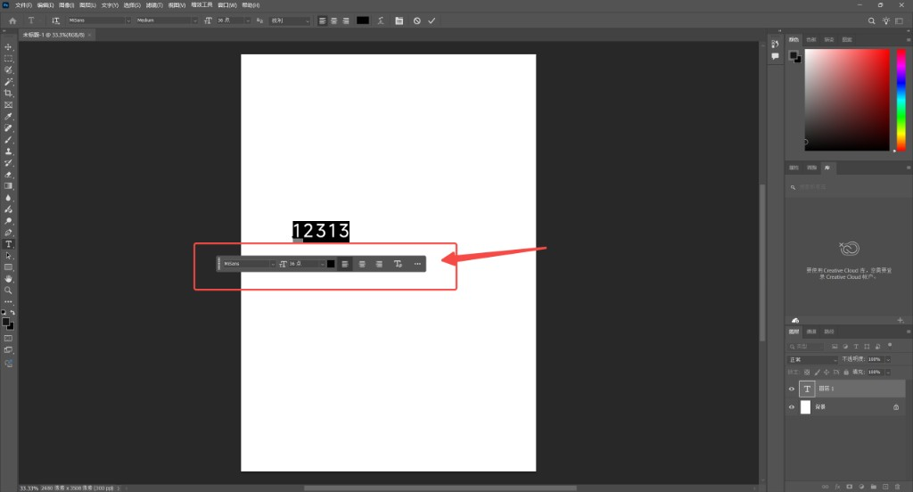

# imagep

个人图片托管仓库，存放博客、文档、视频脚本中可公开引用的截图素材。

**基础直链格式：**

```
https://raw.githubusercontent.com/Yorha4D/imagep/main/<文件名>
```

## 使用方法

**Markdown**

```md

```

**HTML**

```html

```

## 图片索引

### Blender

| 预览 | 文件 | 说明 |
|------|------|------|
|  | [blender-5.2-text-ui.png](./blender-5.2-text-ui.png) | Blender 5.2 文字编辑 UI：Text Helper、字体浏览器、多语言文字排版 |
|  | [blender-font-browser-ui.png](./blender-font-browser-ui.png) | Blender 5.2 字体浏览器与文字样式工具栏 |

### Photoshop

| 预览 | 文件 | 说明 |
|------|------|------|
|  | [photoshop-text-toolbar-zh.png](./photoshop-text-toolbar-zh.png) | Photoshop 中文版文字浮动工具栏 |

## 直链速查

| 文件 | 直链 |
|------|------|
| blender-5.2-text-ui.png | https://raw.githubusercontent.com/Yorha4D/imagep/main/blender-5.2-text-ui.png |
| blender-font-browser-ui.png | https://raw.githubusercontent.com/Yorha4D/imagep/main/blender-font-browser-ui.png |
| photoshop-text-toolbar-zh.png | https://raw.githubusercontent.com/Yorha4D/imagep/main/photoshop-text-toolbar-zh.png |
